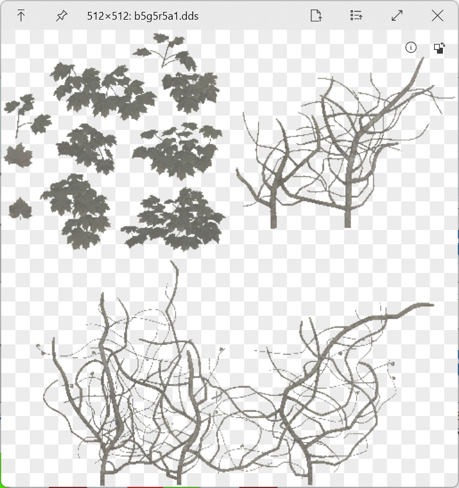

# QuickLook.Plugin.DDSViewer

    
    
    

 

from Pfim's test example.

- Support `Rgba32`, `Rgb24`, `R5g5b5a1`, `R5g5b5`, `R5g6b5`, `Rgb8` image formats.

# Method
- Converting DDS to PNG by Pfim.
- Using `ImageViewer` to display the thumbnail file.

# Download and Installation
1. Go to [Release page](https://github.com/zhangkaihua88/QuickLook.Plugin.DDSViewer/releases) and download the latest version.
2. Make sure that you have QuickLook running in the background. Go to your Download folder, and press Spacebar on the downloaded `.qlplugin` file.
3. Click the "Install" button in the popup window.
4. Restart QuickLook.
5. Select the file(`.cdr`) and press Spacebar.

# Thanks to
- [QuickLook.Plugin.ImageViewer](https://github.com/QL-Win/QuickLook/)
- [Pfim](https://github.com/nickbabcock/Pfim)